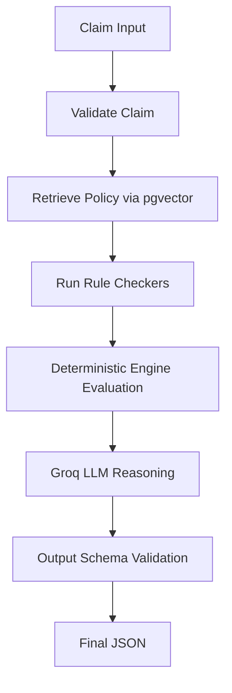

# System Flow (Node by Node)

This document explains the exact step-by-step pipeline (flow) that a claim goes through when processed by the LangGraph Agent.

## Overview

## Step 1: Claim Input & Validation (`validate_claim_node`)
- **Action**: The raw JSON claim enters the system.
- **Process**: Pydantic models (`ClaimModel`) parse the incoming data to ensure all fields (dates, amounts, categories) are the correct data types.
- **Output**: A validated Python dictionary ready for processing.

## Step 2: Policy Retrieval (`retrieve_policy_node`)
- **Action**: Fetch relevant company rules based on the claim.
- **Process**: Extracts categories from the claim (e.g., "lodging", "airfare"). Converts these queries into vector embeddings using `sentence-transformers`. Queries `pgvector` in PostgreSQL using Cosine Similarity to find the exact matching rules (e.g., "Lodging limit is $200").
- **Output**: A list of highly relevant policy text blocks.

## Step 3: Run Rule Checkers (`run_tools_node`)
- **Action**: Execute individual Python tool functions.
- **Process**:
  - `check_receipts()`: Checks if >$25 items have receipts attached.
  - `check_limits()`: Calculates allowable amounts vs claimed amounts for meals/hotels.
  - `check_airfare_class()`: Scans strings for "business" or "first" class.
  - `check_timeliness()`: Calculates the days between `trip_end` and `submitted_date`.
  - `check_approval_threshold()`: Checks if total is > $2,000.
- **Output**: A dictionary containing the raw math and true/false flags from all tools.

## Step 4: Deterministic Engine (`policy_evaluation_node`)
- **Action**: Make the absolute financial decision.
- **Process**: Takes the tool outputs and applies strict precedence:
  1. If Late / Missing Receipt / Business Class / >$2000 -> `MANUAL_REVIEW`
  2. If allowed amount == 0 -> `REJECT`
  3. If allowed amount < claimed amount -> `PARTIAL_APPROVE`
  4. Else -> `APPROVE`
- **Output**: The exact approved amount, deducted amount, and final decision status.

## Step 5: Groq LLM Reasoning (`llm_reasoning_node`)
- **Action**: Generate a human-readable explanation.
- **Process**: A prompt is compiled containing the Claim, the Retrieved Policies, the Tool Math, and the Final Decision. Groq is instructed to *explain* why the decision was made without altering the mathematical outcome.
- **Output**: A short, professional text string (e.g., "The claim is partially approved because the hotel cost $250/night, exceeding the $200 policy limit by $100 total.")

## Step 6: Output Validation (`output_validation_node`)
- **Action**: Guarantee structural integrity.
- **Process**: Passes the final dictionary through a strict Pydantic model (`AgentOutputModel`). If Groq hallucinated a field, Pydantic strips or corrects it safely.
- **Output**: The flawless, final JSON object ready for the dashboard.

## Step 7: Audit Trail Logging (Background)
- **Action**: During *every* step above, the agent silently writes a row to the `audit_logs` table in PostgreSQL recording the node name, input data, and output data for compliance tracking.
